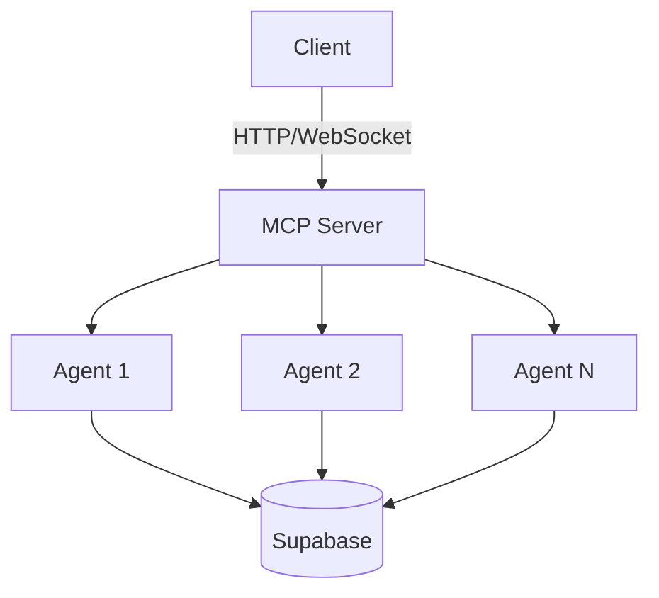

# MCP Package Overview

The Model Context Protocol (MCP) package provides a standardized way for ClearNet agents to communicate and coordinate. This package implements the MCP server and client components needed for agent-to-agent and agent-to-service communication.

## Core Concepts

- **Agents**: Autonomous entities that can perform actions and communicate with other agents
- **Actions**: Operations that agents can perform, exposed as API endpoints
- **Middleware**: Plugins for authentication, logging, and metrics
- **API**: RESTful endpoints for interacting with agents

## Getting Started

See the [Setup Guide](./02-setup.md) for installation and configuration instructions.

## Architecture

