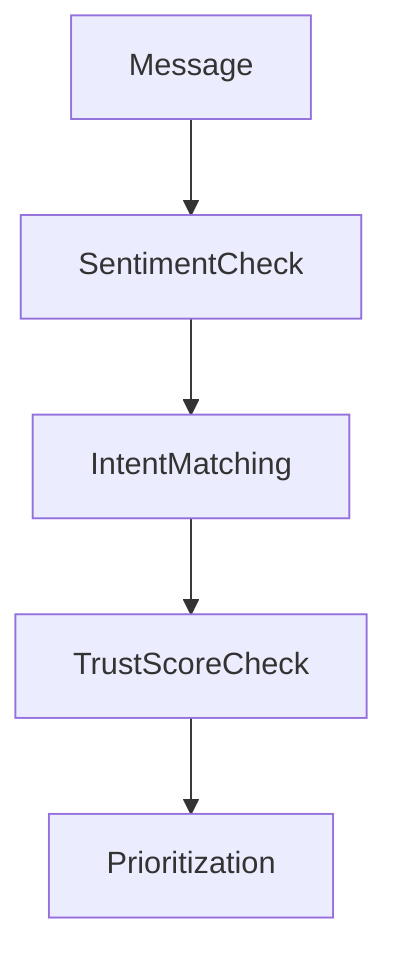

# 🧠 ClearNet Agent Layer Planning

## 🎯 Purpose

This doc breaks down the architecture, behaviors, flows, and roles of AI agents within ClearNet. All agents are coordinated using Multi-Agent Coordination Protocols (MCPs) via LangGraph. The goal is to provide explainable, user-consented automation that enhances discovery, reduces noise, and promotes meaningful connection.

---

## 📐 Design Principles

* **Transparency-first**: All agent actions are auditable.
* **User-owned**: Agents act on behalf of the user, never override consent.
* **Extensible**: Community developers can add, fork, or modify agents.
* **Composable**: Agents are built as LangGraph nodes connected via shared memory and workflows.

---

## 🤖 Core Agents

| Agent Name         | Role                                                  | Coordination Pattern    |
| ------------------ | ----------------------------------------------------- | ----------------------- |
| `BuilderAgent`     | Helps user articulate profile, values, projects       | Plan-and-Act            |
| `InboxSentinel`    | Filters, summarizes, and triages inbound messages     | Chain-of-Responsibility |
| `ScoutAgent`       | Surfaces relevant jobs, collaborations, or people     | Observe-Orient-Act      |
| `GhostwriterAgent` | Drafts replies, posts, bios, and content              | Delegation Loop         |
| `OnboardingGuide`  | Walks user through setup, customization, agent opt-in | Sequential Steps        |

---

## 📦 Agent Packaging

All agents live in `/agents/` and follow the same base interface.
Each agent:

* Is initialized via `agent_config.yaml`
* Reads from shared vector memory
* Can be toggled via user settings or group policy
* Logs all actions with explanation

---

## 🧠 Memory System

* **Primary Memory**: pgvector or Weaviate
* **Data Stored**:

  * Embeddings of messages, replies, posts
  * User preferences
  * Agent action logs
  * Trust indicators

---

## 🕸 Coordination Flows (MCP)

### BuilderAgent


### InboxSentinel



---

## 🧩 Integration Hooks

Agents will expose internal APIs via FastAPI, such as:

```python
POST /agent/inbox_sentinel/filter
POST /agent/builder/profile
POST /agent/ghostwriter/draft
```

---

## 🔌 Extending the Agent System

Developers can:

* Fork any agent module (e.g., `agents/scout_agent.py`)
* Register new agents in `agent_config.yaml`
* Override LangGraph behavior (e.g., planner → actor split)
* Contribute reusable subflows (like summarizers, explainers)

---

## 🛣 Roadmap

* [ ] Define shared vector schema
* [ ] Ship MVP of `InboxSentinel`
* [ ] Expose audit log UI for agent transparency
* [ ] Launch `agent_config.yaml` dynamic loader
* [ ] Enable per-group agent delegation config
* [ ] Publish open agent development starter kit
